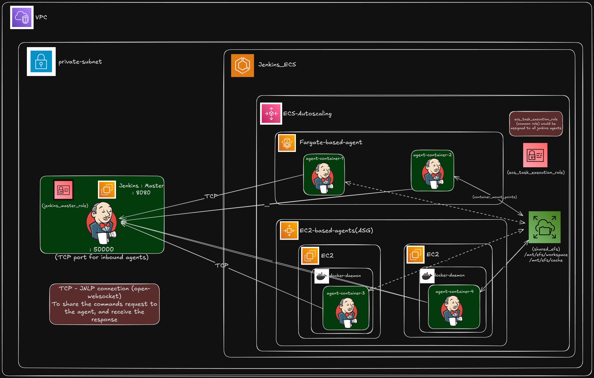

# Jenkins Master-Agent Infrastructure with ECS

This Terraform configuration creates a complete Jenkins Master-Agent architecture using AWS ECS with Fargate and EC2 launch types for cost-optimized CI/CD automation.

## Architecture Overview



- **Jenkins Master**: EC2 instance with Docker Compose running Jenkins LTS
- **ECS Cluster**: Three capacity providers (Fargate, Fargate Spot, EC2 ASG)
- **EFS**: Shared storage for Jenkins data and build cache
- **VPC**: Multi-AZ setup with public/private subnets
- **Security Groups**: Properly configured for Jenkins and ECS communication
- **IAM Roles**: Least privilege access for all components

## Features

- ✅ Jenkins LTS running in Docker with ports 8080 and 50000
- ✅ ECS Fargate agents for moderate workloads
- ✅ ECS Fargate Spot for cost optimization
- ✅ ECS EC2 (Graviton) agents for heavy workloads and Docker-in-Docker
- ✅ EFS for persistent storage and build caching
- ✅ Auto Scaling Group with launch template
- ✅ Comprehensive security groups and IAM roles
- ✅ CloudWatch logging for all components

## Quick Start

### Prerequisites

1. AWS CLI configured with appropriate permissions
2. Terraform >= 1.0 installed
3. EC2 Key Pair (optional, for SSH access)

### Deployment

1. **Clone and navigate to the project:**
   ```bash
   cd terraform-jenkins-infrastructure/environments/dev
   ```

2. **Update variables:**
   Edit `terraform.tfvars` and set your desired configuration:
   ```hcl
   aws_region   = "us-west-2"
   environment  = "dev"
   project_name = "jenkins-automation"
   key_pair_name = "your-key-pair-name"  # Optional
   ```

3. **Initialize Terraform:**
   ```bash
   terraform init
   ```

4. **Plan the deployment:**
   ```bash
   terraform plan
   ```

5. **Apply the configuration:**
   ```bash
   terraform apply
   ```

6. **Access Jenkins:**
   After deployment, get the Jenkins URL from outputs:
   ```bash
   terraform output jenkins_url
   ```

## Module Structure

```
terraform-jenkins-infrastructure/
├── main.tf                    # Root module
├── variables.tf               # Root variables
├── outputs.tf                 # Root outputs
├── modules/
│   ├── vpc/                   # VPC, subnets, routing
│   ├── security-groups/       # Security groups for all components
│   ├── iam/                   # IAM roles and policies
│   ├── efs/                   # EFS file system and access points
│   ├── ec2/                   # Jenkins master and ASG
│   └── ecs/                   # ECS cluster and capacity providers
└── environments/
    └── dev/                   # Development environment
```

## Configuration Details

### Jenkins Master

- **Instance Type**: t3.medium (configurable)
- **OS**: Amazon Linux 2
- **Docker**: Latest version with Docker Compose
- **Jenkins**: LTS version via Docker
- **Storage**: 50GB EBS (encrypted) + EFS mount
- **Ports**: 8080 (UI), 50000 (agents)

### ECS Cluster

**Capacity Providers:**
- **FARGATE**: Default for standard builds
- **FARGATE_SPOT**: Cost-optimized option
- **EC2 ASG**: Graviton instances for heavy workloads

**Auto Scaling Group:**
- **Instance Type**: t4g.medium (Graviton-based)
- **Min/Max/Desired**: 0/10/0 (scales on demand)
- **Subnets**: Private subnets only

### EFS Configuration

- **Performance Mode**: General Purpose
- **Throughput Mode**: Provisioned (100 MiB/s)
- **Encryption**: Enabled
- **Access Points**: 
  - `/jenkins` - Jenkins home directory
  - `/build-cache` - Shared build cache

### Security Groups

- **Jenkins Master**: Ports 22, 8080, 50000
- **ECS ASG**: Ports 22, 32768-65535, 50000
- **ECS Fargate**: Port 50000
- **EFS**: Port 2049 (NFS)

## Usage Examples

### Using Fargate Agents in Jenkins Pipeline

```groovy
pipeline {
    agent {
        ecs {
            inheritFrom 'jenkins-automation-dev-fargate'
            image 'your-account.dkr.ecr.region.amazonaws.com/build-agent:latest'
        }
    }
    
    stages {
        stage('Build') {
            steps {
                sh 'echo "Building on Fargate agent"'
            }
        }
    }
}
```

### Using EC2 Agents for Docker-in-Docker

```groovy
pipeline {
    agent {
        ecs {
            inheritFrom 'jenkins-automation-dev-ec2'
            image 'your-account.dkr.ecr.region.amazonaws.com/docker-agent:latest'
        }
    }
    
    stages {
        stage('Docker Build') {
            steps {
                sh 'docker build -t myapp .'
            }
        }
    }
}
```

## Cost Optimization

1. **Use Fargate Spot** for non-critical builds (50% cost savings)
2. **Set ASG desired capacity to 0** - scales only when needed
3. **Use EFS Intelligent Tiering** for automatic cost optimization
4. **Monitor CloudWatch metrics** to right-size instances

## Monitoring and Logging

- **CloudWatch Logs**: `/ecs/jenkins-automation-dev` and `ecs-agent`
- **ECS Container Insights**: Enabled for cluster monitoring
- **Jenkins Logs**: Available via Docker logs and EFS mount

## Security Best Practices

- All traffic between components uses security groups
- EFS and EBS volumes are encrypted
- IAM roles follow least privilege principle
- Jenkins master in public subnet (can be moved to private with ALB)
- ECS agents in private subnets only

## Troubleshooting

### Jenkins Not Starting
```bash
# SSH to Jenkins master and check Docker logs
docker logs jenkins-master
```

### ECS Agents Not Connecting
```bash
# Check ECS agent logs on ASG instances
sudo docker logs ecs-agent
```

### EFS Mount Issues
```bash
# Verify EFS mount on instances
df -h | grep efs
```

## Customization

### Adding New Agent Types

1. Create new Dockerfile in your repository
2. Build and push to ECR
3. Configure new agent template in Jenkins
4. Use in pipelines with `inheritFrom` parameter

### Scaling Configuration

Modify `terraform.tfvars`:
```hcl
asg_max_size = 20           # Increase max instances
jenkins_instance_type = "t3.large"  # Upgrade Jenkins master
```

## Cleanup

To destroy all resources:
```bash
terraform destroy
```

## Support

For issues and questions:
1. Check CloudWatch logs for error details
2. Verify security group rules
3. Ensure IAM permissions are correct
4. Review ECS service events

## License

This project is licensed under the MIT License.